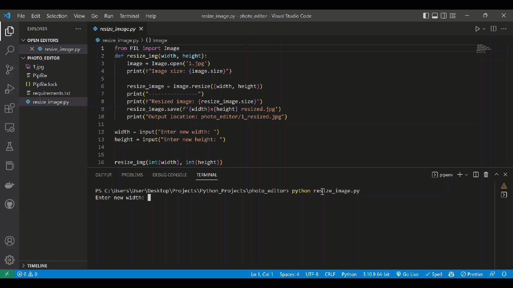

# Photo Resize Tool

>Resize your photos to a specific size and download them. 



Enter the new width.

Enter the new height.

Save the resized image.

## Demo
## Quick Start

```bash
# install dependencies
pipenv install -r requirements.txt

# Run
python resize_image.py
```
